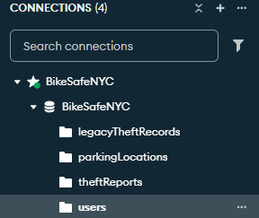

# BikeSafe NYC
Group 23 CS546WN

BikeSafe NYC

# Local Development

## MongoDB Setup
To locally test/develop with MongoDB, use the following setup:
* Database Name: `BikeSafeNYC`
* Collection Name: `BikeSafeNYC`

### Seed data

Run `npm run seed` in your terminal. You should expect to see an output of: `Seeded data!!!` if all was succesful. 